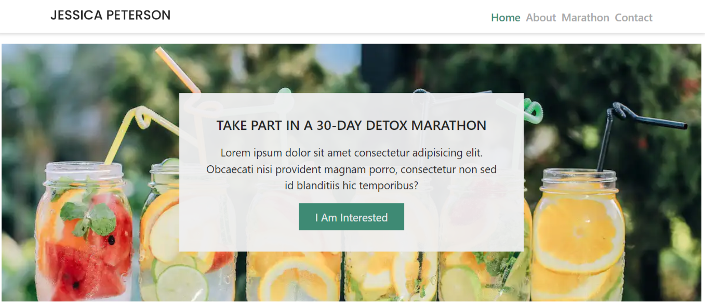

# Portfolio Website of Frontend Developer, Idoko Emmanuel

Headless Blog built with Netxjs and Tailwindcss deployed on vercel, 
Conected to Contentful CMS for content management through a graphQL API
 
 



Setup 

```**bash**

# Install dependencies
$ npm install

# Serve with hot reload at localost:3000
$ npm run dev

# Generate static project
$ npm run build


```